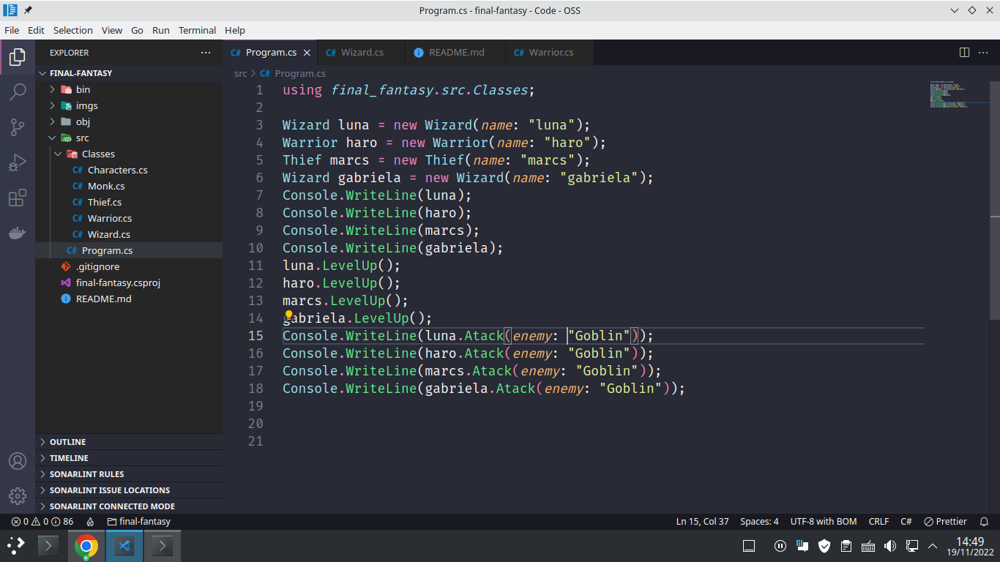

# Project developed in English and Portuguese/Projeto desenvolvido em português e inglês.

 

 

# [ENG]

Using the code editor, you can play a Final Fantasy game. For this, you can create 4 characters and use then to fight against enemy.

You have 2 options, `attack` where you will use your weapon to deal damage.
Special Skill. The mages have `magic`, the thieves `steal`, monks `combos` and warriors `protect`

# How can I play this game?

First, it's necessary to install two programs.
<a href="">git</a> to download the code.
<a href="">dotnet</a> to run the code.

#### I recommend you to install Visual Studio or Visual Studio Code to write in the code.

Now, open the source code in your terminal, or in the terminal of the Visual Studio Code, and type `dotnet run`

:warning: The project is in development :warning:
Features

- [x] Characters creation
- [x] Attack
- [x] Skill
- [x] Level up
- [] Damage calculation
- [] Enemies creation
- [] XP gain

# [PT-BR]

Usando um editor de códigos, você conseguirá jogar um pequeno RPJ. Para isso, você poderá criar 4 personagens. Warrior(Guerreiro),Monk(Monge),Thief(Ladrão) e Wizard(Mago).

Para atacar, você possui 2 opição, `attack`(Atacar) onde você causará dano usando a sua arma.
E as abilidades especiais de classe. Os magos possuem `magic`(Magia), Os ladrões `steal`(Roubar), monks `combos` and warriors `protect`(Defender)

# Como jogar esse jogo?

Primeiramente, Precisamos instalar 2 programas.
<a href="">git</a> Para conseguirmos baixar os códigos.
<a href="">dotnet</a> para rodar os códigos.

#### Eu recomendo instalar o Visual Studio Code, para a edição

Agora, abra o terminal na pasta onde está o código fonte, ou abra o terminal do VS code, e digite `dotnet run`

:warning: O projeto está em desenvolvimento :warning:
Funções

- [x] Criação de personagens
- [x] Atacar
- [x] Abilidades
- [x] Level up
- [] Calcular dano
- [] Criar Enimigos
- [] Ganhar XP
